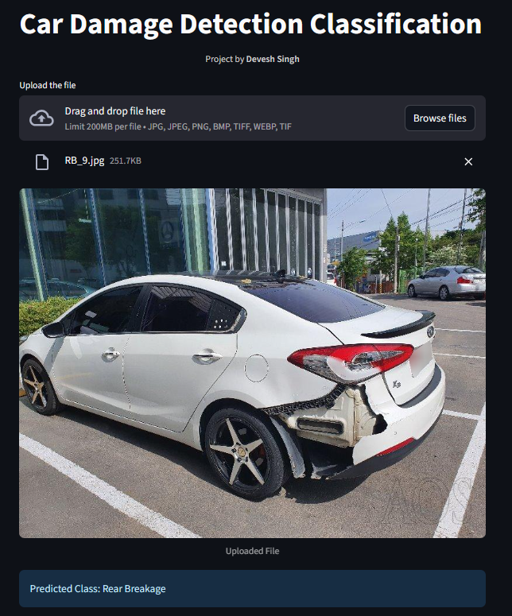

# Car Damage Detection Classification (Drag & Drop App)

**Check out the live app here:  [Live Demo](https://demonforms-car-damage.streamlit.app/)**

This application allows you to **drag and drop an image of a car** (third-quarter front or rear view) and automatically predicts the type of **damage**.

The model has been trained on a curated dataset of **~1700 images** and classifies cars into **6 target classes**:

- **Front Normal**
- **Front Crushed**
- **Front Breakage**
- **Rear Normal**
- **Rear Crushed**
- **Rear Breakage**

---

## Model Performance

- **Final Model:** ResNet50 (with Optuna hyperparameter tuning)
- **Validation Accuracy:** ~80%  
- **Training Pipeline:**
  1. **CNN (ReLU + MaxPooling):** 57% validation accuracy  
  2. **CNN (BatchNorm + Dropout):** 50% (worse due to over-regularization)  
  3. **EfficientNet (transfer learning):** 65%  
  4. **ResNet50 (baseline):** 76%  
  5. **ResNet50 + Optuna Tuning:** ~80% (final)

---

## Tech Stack

- **Backend / Model Serving:** Python3.11+, PyTorch, Pytorch Vision, Matplotlib, Optuna etc
- **Frontend:** Drag-and-drop UI using Streamlit 
- **Deployment:** Streamlit Cloud 

---

## Features

- Drag & Drop car images  
- Real-time classification  
- Supports **front and rear third-quarter views**  
- Lightweight model deployment
- ~80% accuracy on validation set  

---

## Author

Developed by Devesh Singh